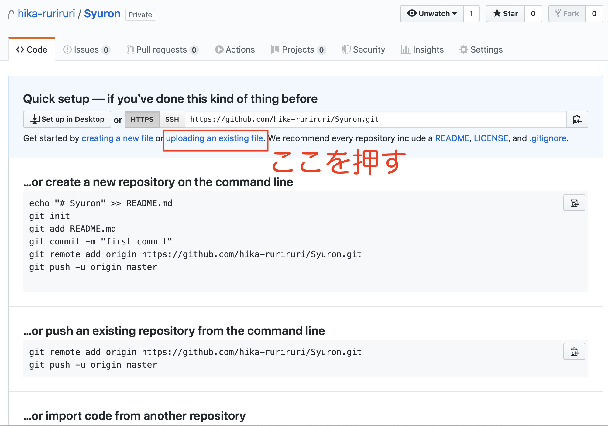

# 超超超超入門Git/Github講座-黒い画面ナシでファイルの更新履歴管理しよう-

## 概要
Githubを使って**ファイルの更新履歴管理**をする方法**だけ**を説明します。
Git機能を超簡単に使って勉強意欲を高めてもらうことを目的とした記事です。
詳しい説明を期待しないでください。
## はじめに
誰しもが通る道

```
修論.tex
修論_1.tex
修論修正版.tex
修論修正版(1).tex
修論_先生コメント.tex
修論最終.tex
修論rev.tex
修論_図rev.tex
syuron_final.tex
syuron.tex
Finalsyuron.tex
Final(2).tex
ほんとうにさいご.tex
ほんとうにさいご(1).tex
```
**最終版どれだよ！？！？**ってなりますよね。
こうなったとき、友人から
**「Gitを使ってバージョン管理をすれば良いんだよ！」**
ってドヤ顔で言われたことありませんか？僕は10回くらいあります。
それを言われるたびに

* 「Git バージョン管理」って検索
* 「git initって黒い画面に打ち込んで〜」「mergeが〜branchが〜」謎用語だらけ
* 勉強意欲が失せる
* 「時間があるときに勉強しよう」
* 結局勉強しない
* 誰もお前を愛さない

と悪循環ループ。僕は10回くらいこのループを繰り返しました。
目的を達成するためには「**ファイルの更新履歴の管理**」だけが出来れば良いのです。
そのやり方**だけ**を今回覚えましょう。**超簡単**です。

## まずはGithubに登録だ！
Githubのサイトにアカウントを作りましょう
https://github.com/
Githubってなに？ →　Gitが使える超便利な情強サイトです。
そもそもGitって? → 更新履歴が管理出来るらしい。
程度の認識で良いです。まずはメールアドレスとアカウント名を登録してください。
こんな感じでプランを選ばされます。無料プランを選びましょう(左側)。

使い方を聞かれます、適当に答えましょう。


## リポジトリを作ろう
リポジトリとは？→作業フォルダのことです。
ホーム画面がこんな感じになると思います。緑色のCreate repositoryってボタンを押しましょう。


こんな画面が出てくると思います(デモのため仮アカウントで作ってます)。

* リポジトリの名前(作業フォルダの名前)を決める → Syuronとかにしましょう
* Privateボタンを選択 → Publicにすると黒歴史修論が世に放たれます

これだけで大丈夫です。細かいところは気が向いたら調べましょう。
Create repositoryって緑色のボタンを押してください。


## ファイルをアップロードしてみよう
リポジトリを作ったらなんだかよくわからない画面に遷移しましたね
(このページに書いてあるよくわからないコマンドを見て僕は一度絶望しました)。
水色の部分にある
**uploading an existing file** 
って文字を押してください



ページが遷移しましたね。編集するファイルをこのページに**直接ドラックアンドドロップ**してみてください。ファイルをマウスで動かしてページの上に持ってくるだけです。


アップロードされたらCommit changesって緑色のボタンを押しましょう。
Commitって？ → 気が向いたら自分で調べてください


ファイルのアップロードに成功しました！
## ここからが本番、ファイルの更新と履歴を見よう
さて、アップロードしたあとに指導教官から修論を真っ赤に添削されてファイルを更新する必要が....
Githubなら簡単、ただこのページに更新後のファイルを**直接ドラックアンドドロップ**するだけです！


Commit changesって欄に直した一言理由と詳しい内容を書いておきましょう。Commit changesの緑色のボタンを押してください。


更新完了です。
さて、**更新履歴がちゃんと残ってるのでしょうか？**
ちゃんと**元の状態に復元出来るのでしょうか？**
Githubなら簡単に出来ます。Commitsのボタンを押してみましょう。


更新履歴っぽいページに移りましたね。


「図のラベル修正」って書いた部分を押してみましょう、テキストファイルの場合は差分が詳しく見られます。
texソースでレポートor論文を書いている場合やプログラミングのソースコードの場合だったら便利そうですね。


最初の状態を復元してみましょう、「<>」ってなってるボタンを押しましょう。
なんか最初の状態に戻ってるっぽいですね。Clone or downloadって緑色のボタンを押すと、この地点でのファイル一同がダウンロード出来るっぽいです。


ちゃんと最初の状態に戻っていますね。


Githubを使ってファイルのバージョン管理を楽チンにして圧倒的成長しましょう。
## 勉強意欲が湧いたら
Git/Githubの詳しい解説については
- <a href="https://backlog.com/ja/git-tutorial/">
サルでもわかるGit入門</a>
- <a href="https://speakerdeck.com/kaityo256/starting-git">数値計算屋のためのGit入門 / Starting Git</a>
- <a href="https://techacademy.jp/magazine/6235">今さら聞けない！GitHubの使い方【超初心者向け】</a>
とか参考にしてください。 

本を買うのも良いと思います、僕が買った本はこれです。普通にわかりやすいです。 

<a href="https://book.impress.co.jp/books/1114101005.php">Web制作者のためのGitHubの教科書 チームの効率を最大化する共同開発ツール</a>

