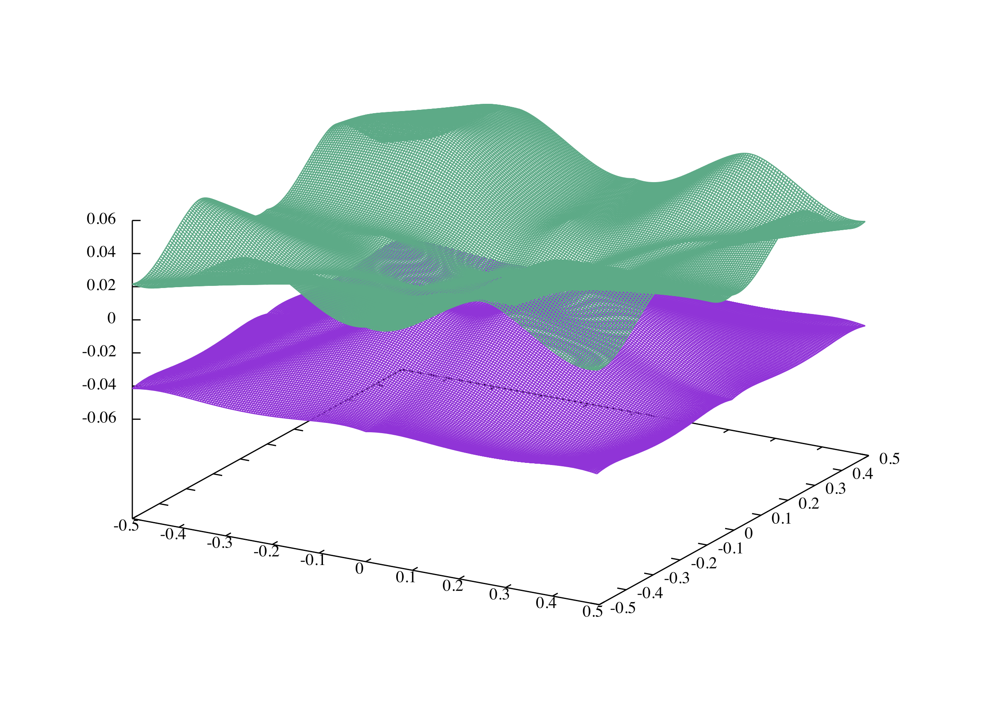
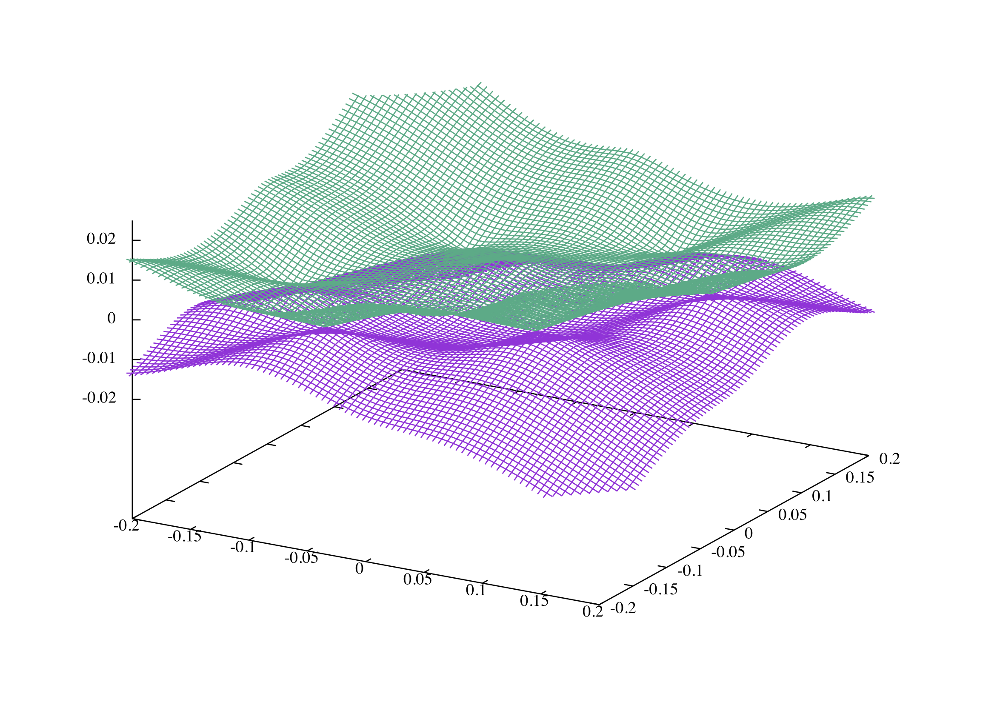
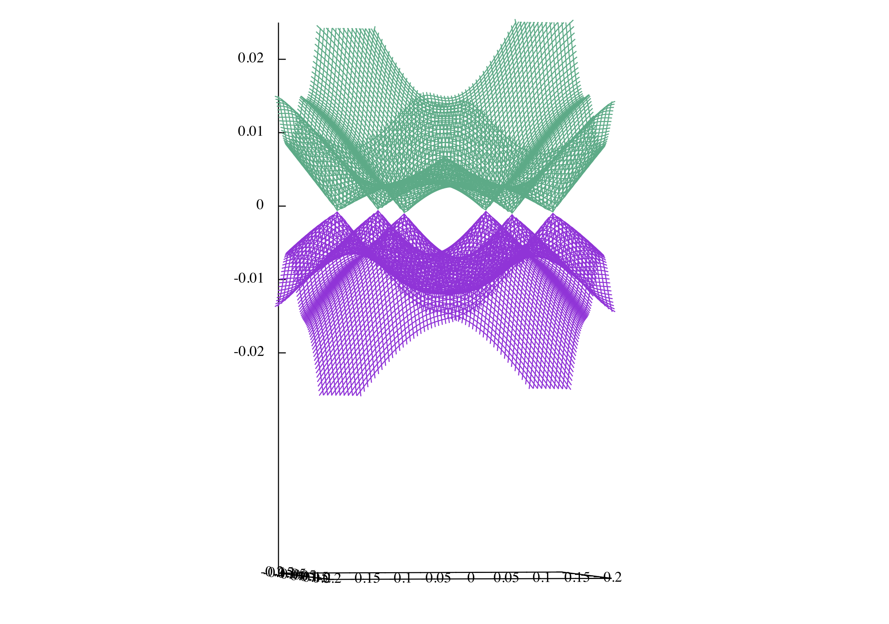
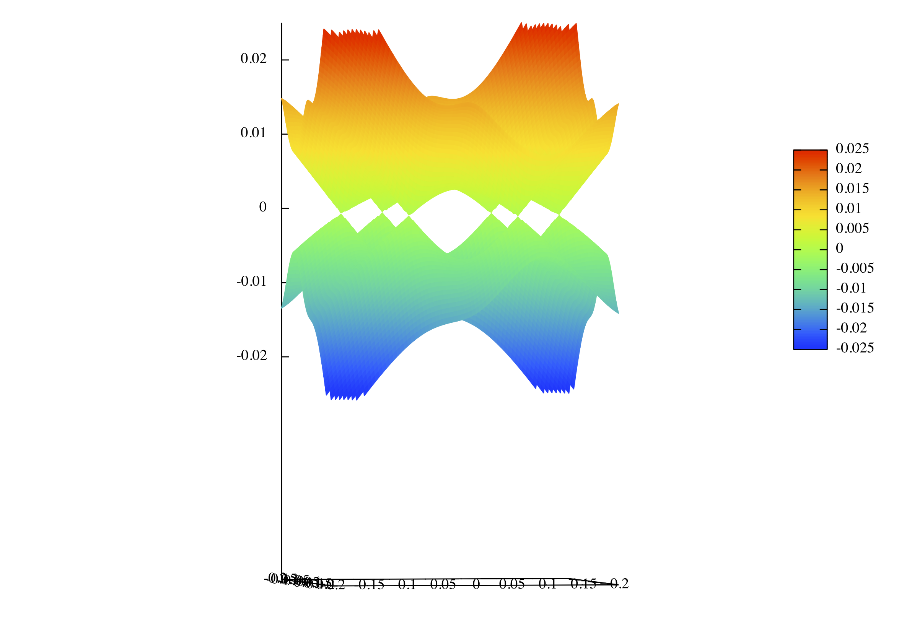
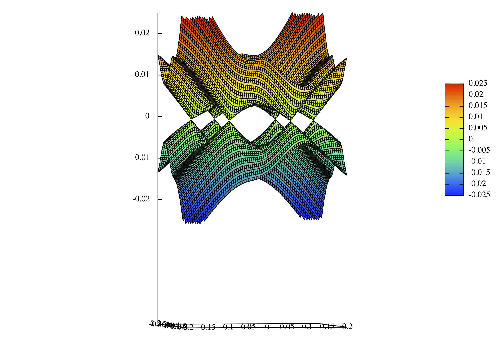

# 綺麗な三次元バンド図をgnuplotで作る。
## はじめに
論文にカッコいいDirac cone(https://en.wikipedia.org/wiki/Dirac_cone) の図を載せたいと思い、gnuplotで何とか作れないかと試行錯誤したときのことを書きたいと思います。
同じくカッコいい3次元のバンド図を作りたい方の参考になればと思います。
使ったgnuplotのversionは5.2、Aquatermを出力先に指定しています。

## データファイルの準備
kx,ky,Eigenenergyのデータを準備。

```
#kx ky Eigenenergy
-0.500000 -0.500000 -4.15058469e-02
-0.495000 -0.500000 -4.12624296e-02
-0.490000 -0.500000 -4.10399042e-02
(中略)
0.490000 -0.500000 -4.10399072e-02
0.495000 -0.500000 -4.12624326e-02
(2行目の値が変化するときに空行)

-0.500000 -0.495000 -4.12624326e-02
-0.495000 -0.495000 -4.14517312e-02
(以下略)
```

というように1行目が先に変化していく形式で出力する。もしこの形式でなければplotコマンドに

```
set dgrid メッシュ数, メッシュ数
```

を入れる必要アリ。

## とりあえず書いてみた

splotを使ってデフォルト値でプロットしてみる

```perl 
splot "Valence.dat" u 1:2:3 with line notitle
replot "Conduction.dat" u 1:2:3 with line notitle
```

これではDirac coneが見えない。

## プロット範囲を狭める

$-0.2\leq k_x,k_y \leq 0.2$くらいの場所にDirac点があり、Fermi準位付近だけを書けば良いので

```perl 
set xrange[-0.2:0.2]
set yrange[-0.2:0.2]
set zrange[-0.025:0.025]
```
としてみる。

Dirac coneが少しだけ見えてきたがなんか安っぽい。

## 視点、z軸方向の比率を変更
set viewを使って水平視点から眺める、z軸方向を伸ばす。上手く3次元図を書くにはこのオプションがどうやら重要のようだ。

```perl 
set view 88, 80, 0.6, 3
```

set viewは一行目から$\theta$方向の視点、$\phi$方向の視点、グラフの拡大率、z軸方向の拡大率を表す。




**それっぽくなってきた**

#色を付ける
set pm3dを使ってカラフルに色を付ける。

```perl 
set pm3d
set palette rgbformula 22,13,-31
splot "Valence.dat" u 1:2:3 with pm3d notitle
replot "Conduction.dat" u 1:2:3 with pm3d notitle
```



**三次元感がない。**

#格子線を入れる
3次元感を出すために

```perl 
set pm3d hidden3d
```

としてみた



**カッコいい....これぞDirac cone**

## Plotコマンドまとめ

```perl:Dirac.plt
set pm3d hidden3d
set xrange[-0.2:0.2]
set yrange[-0.2:0.2]
set zrange[-0.025:0.025]
set view 88, 80, 0.6, 3
set palette rgbformula 22,13,-31
splot "Valence.dat" u 1:2:3 with pm3d notitle
replot "Conduction.dat" u 1:2:3 with pm3d notitle
```
終わってみればシンプルに書けるみたいだ。

## 使用例
論文に載せました。
https://doi.org/10.7567/1882-0786/ab25d3
(arXivはhttps://arxiv.org/abs/1905.05944)