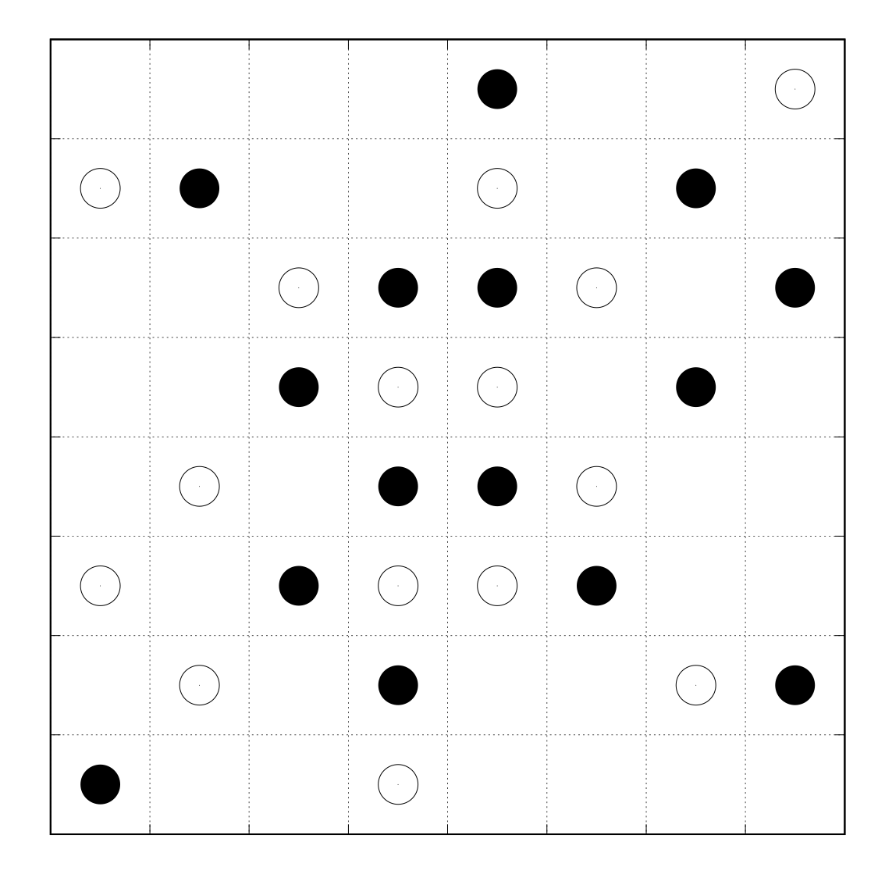

# はじめに
私の研究上
http://journals.jps.jp/doi/10.1143/JPSJ.74.1674 のFig.2
http://journals.jps.jp/doi/abs/10.1143/JPSJ.76.053702 のFig.2
のような**オセロっぽい図**を書く必要が出て来ました。
gnuplot が大好きな私はこれを gnuplot で楽に再現出来ないかと考え、試行錯誤して出来た簡単な方法を紹介したいと思います。
同じくオセロっぽい図を書きたい方(？)に参考にして頂きたいと思います。
# データファイルの準備
まず、黒石と白石の座標データをそれぞれカタマリにして書き下します。

``` position.dat
#white stone
-0.062500 0.062500
-0.187500 0.187500
-0.437500 0.312500
0.062500 0.062500
0.187500 0.187500
0.062500 0.312500
0.437500 0.437500
-0.312500 -0.062500
-0.437500 -0.187500
-0.062500 -0.187500
-0.312500 -0.312500
-0.062500 -0.437500
0.187500 -0.062500
0.062500 -0.187500
0.312500 -0.312500


#black stone
-0.187500 0.062500
-0.062500 0.187500
-0.312500 0.312500
0.312500 0.062500
0.437500 0.187500
0.062500 0.187500
0.312500 0.312500
0.062500 0.437500
-0.062500 -0.062500
-0.187500 -0.187500
-0.062500 -0.312500
-0.437500 -0.437500
0.062500 -0.062500
0.187500 -0.187500
0.437500 -0.312500
```
一行の座標が石一個の座標に対応しているワケです。
# プロットする
マス目を書く必要があるのでグリッドを入れます

```
set grid
```

オセロっぽく正方形にするために

```
set size square
```

目盛りの間隔は丁度石が一個になるように

```
set xrange[-0.5:0.5]
set yrange[-0.5:0.5]
set xtics 0.125000
set ytics 0.125000
```
黒石、白石のプロット点をindexによって指定します。
index 0 が1つ目の塊、index 1 が２つ目のカタマリなので

```
plot "position.dat" index 0 w p ps 4.0 pt 7 lt -1 notitle
```

まとめると、

``` perl:stone.plt
set xrange[-0.5:0.5]
set yrange[-0.5:0.5]
set xtics 0.125000
set ytics 0.125000
set grid
set nokey
set size square                                                            
set tics font "Helvetica,0.1"
plot "position.dat" index 0 w p ps 4.0 pt 7 lt -1 title "-1","position.dat" index 1 w p ps 4.0 pt 6 lt -1 title "+1"
set terminal postscript enhanced color
set terminal postscript font "Helvetica,0.1"
set output "stone.eps"
replot
```
という感じになります。

# 完成
プロットしてみました。

**オセロっぽい**

# 使用例
完成した図に更に色々書き加えて投稿論文のFig.4に載せました。
http://iopscience.iop.org/article/10.7567/JJAP.57.030309
(arXiv:https://arxiv.org/abs/1710.04812)

